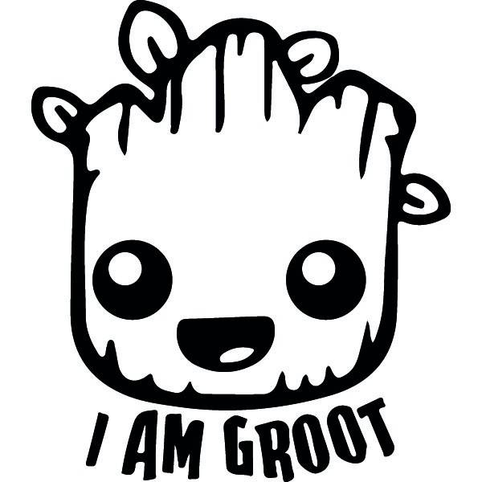

# GrootLang: A Musical Note System for AI Voice Commands

<p align="center">
  
</p>

## Description

GrootLang is an intuitive voice command system that uses musical note patterns in the phrase "I am Groot" to control AI. By varying the pitch of each word according to do-re-mi scales, users can trigger specific AI actions through melody rather than vocabulary, creating a universal, accessible interface.

## Core Concept

GrootLang maps the standard musical scale (do-re-mi-fa-sol-la-si) to the three words in "I am Groot":

```
"I"   - First position note
"am"  - Second position note
"Groot" - Third position note
```

Each unique combination of notes creates a distinct command for the AI system. The words themselves don't matter semantically - it's purely the musical pattern that triggers commands. This creates a musical-voice interface that is both intuitive and expandable, allowing users to control AI systems through melodic patterns rather than specific vocabulary.

## Musical Notation System

Commands are notated using musical note names:
- C = do
- D = re
- E = mi
- F = fa
- G = sol
- A = la
- B = si

Example: "I am Groot" sung as do-re-mi would be notated as C-D-E.

## Command Categories

### System Control
<table>
  <thead>
    <tr>
      <th>Command</th>
      <th>Musical Pattern</th>
      <th>Description</th>
    </tr>
  </thead>
  <tbody>
    <tr>
      <td>Activate</td>
      <td>C-D-E</td>
      <td>Start or wake up the AI system</td>
    </tr>
    <tr>
      <td>Deactivate</td>
      <td>E-D-C</td>
      <td>End session or put AI to sleep</td>
    </tr>
    <tr>
      <td>Pause</td>
      <td>C-C-C</td>
      <td>Temporarily pause current operation</td>
    </tr>
    <tr>
      <td>Resume</td>
      <td>E-E-E</td>
      <td>Continue paused operation</td>
    </tr>
  </tbody>
</table>

### Navigation & Selection
<table>
  <thead>
    <tr>
      <th>Command</th>
      <th>Musical Pattern</th>
      <th>Description</th>
    </tr>
  </thead>
  <tbody>
    <tr>
      <td>Next</td>
      <td>C-D-C</td>
      <td>Move to next item or option</td>
    </tr>
    <tr>
      <td>Previous</td>
      <td>E-D-E</td>
      <td>Move to previous item or option</td>
    </tr>
    <tr>
      <td>Select</td>
      <td>C-E-G</td>
      <td>Confirm current selection</td>
    </tr>
    <tr>
      <td>Cancel</td>
      <td>G-E-C</td>
      <td>Cancel current operation or go back</td>
    </tr>
  </tbody>
</table>

### Data Input/Output
<table>
  <thead>
    <tr>
      <th>Command</th>
      <th>Musical Pattern</th>
      <th>Description</th>
    </tr>
  </thead>
  <tbody>
    <tr>
      <td>Input Mode</td>
      <td>C-F-C</td>
      <td>AI listens for data input</td>
    </tr>
    <tr>
      <td>Output Results</td>
      <td>E-C-E</td>
      <td>AI presents results or information</td>
    </tr>
    <tr>
      <td>Save</td>
      <td>C-E-C</td>
      <td>Save current data or state</td>
    </tr>
    <tr>
      <td>Load</td>
      <td>E-C-E</td>
      <td>Load saved data or state</td>
    </tr>
  </tbody>
</table>

### Processing Commands
<table>
  <thead>
    <tr>
      <th>Command</th>
      <th>Musical Pattern</th>
      <th>Description</th>
    </tr>
  </thead>
  <tbody>
    <tr>
      <td>Analyze</td>
      <td>C-D-F</td>
      <td>Perform in-depth analysis</td>
    </tr>
    <tr>
      <td>Summarize</td>
      <td>F-D-C</td>
      <td>Create a concise summary</td>
    </tr>
    <tr>
      <td>Compare</td>
      <td>C-G-C</td>
      <td>Compare multiple items or data sets</td>
    </tr>
    <tr>
      <td>Transform</td>
      <td>C-C-G</td>
      <td>Convert data to different format</td>
    </tr>
  </tbody>
</table>

### Context Switching
<table>
  <thead>
    <tr>
      <th>Command</th>
      <th>Musical Pattern</th>
      <th>Description</th>
    </tr>
  </thead>
  <tbody>
    <tr>
      <td>Work Mode</td>
      <td>C-D-G</td>
      <td>Switch to professional/productivity context</td>
    </tr>
    <tr>
      <td>Entertainment Mode</td>
      <td>E-F-A</td>
      <td>Switch to leisure/entertainment context</td>
    </tr>
    <tr>
      <td>Learning Mode</td>
      <td>G-A-B</td>
      <td>Switch to educational context</td>
    </tr>
    <tr>
      <td>Social Mode</td>
      <td>F-E-D</td>
      <td>Switch to communication/social context</td>
    </tr>
  </tbody>
</table>

### Modifier Commands
<table>
  <thead>
    <tr>
      <th>Command</th>
      <th>Musical Pattern</th>
      <th>Description</th>
    </tr>
  </thead>
  <tbody>
    <tr>
      <td>Increase/Faster</td>
      <td>C-E-G</td>
      <td>Speed up or increase value</td>
    </tr>
    <tr>
      <td>Decrease/Slower</td>
      <td>G-E-C</td>
      <td>Slow down or decrease value</td>
    </tr>
    <tr>
      <td>Repeat</td>
      <td>C-C-E</td>
      <td>Repeat previous action</td>
    </tr>
    <tr>
      <td>Undo</td>
      <td>E-C-C</td>
      <td>Reverse previous action</td>
    </tr>
  </tbody>
</table>

## Extended Features

### Compound Commands
Combine multiple "I am Groot" phrases to create more complex operations:

```
"I am Groot, I am Groot" (C-D-E, C-F-C)
```

This activates the system and immediately enters input mode.

### Intensity Variations
Emphasize specific words to modify the command:

```
"I AM Groot" (C-D*-E)
```

The asterisk indicates emphasis, which might increase priority or urgency.

### Rhythm Variations
Vary the timing between words to create additional command distinctions:

```
"I-am-Groot" (quick) vs "I...am...Groot" (slow)
```

## Implementation Examples

### Basic Session
```
User: "I am Groot" (C-D-E)
AI: *activates*

User: "I am Groot" (C-F-C)
AI: *enters input mode* "Ready for input."

User: "Tell me about the weather."
AI: *processes natural language after command*

User: "I am Groot" (F-D-C)
AI: *summarizes* "It's sunny and 72°F today with light winds."

User: "I am Groot" (E-D-C)
AI: *deactivates*
```

### Complex Interaction
```
User: "I am Groot" (C-D-E)
AI: *activates*

User: "I am Groot, I am Groot" (C-D-G, E-C-E)
AI: *switches to work mode and outputs relevant information*

User: "I am Groot" (C-G-C)
AI: *compares items in current context*

User: "I am Groot" (G-E-C, G-E-C)
AI: *cancels twice to return to main menu*

User: "I am Groot" (E-D-C)
AI: *deactivates*
```

## Technical Implementation

### Voice Recognition Requirements
- Pitch detection accuracy: Must distinguish between at least 7 distinct pitches
- Timing analysis: Ability to detect rhythm variations
- Volume analysis: Detection of emphasis on specific words

### AI Interface Implementation

The core of GrootLang is the AI's ability to process musical note combinations and execute appropriate commands. Here's how to implement this functionality:

#### Audio Processing Pipeline

```
Raw Audio → Phrase Detection → Note Extraction → Command Mapping → Execution
```

#### 1. Audio Input Processing
```python
def process_audio_input(audio_stream):
    # Continuously monitor audio stream for the phrase "I am Groot"
    phrase_detected = detect_phrase(audio_stream, "I am Groot")
    
    if phrase_detected:
        # Extract the audio segment containing the phrase
        phrase_segment = extract_phrase_segment(audio_stream)
        return phrase_segment
    return None
```

#### 2. Musical Note Detection
```python
def detect_musical_notes(phrase_segment):
    # Break the phrase into its three components
    word_segments = split_into_words(phrase_segment)  # ["I", "am", "Groot"]
    
    # For each word, detect the dominant musical note (pitch)
    notes = []
    for word in word_segments:
        dominant_frequency = analyze_frequency(word)
        musical_note = frequency_to_note(dominant_frequency)  # Maps Hz to do-re-mi
        notes.append(musical_note)
    
    return notes  # Example: ["do", "re", "mi"]
```

#### 3. Command Mapping
```python
def map_notes_to_command(notes):
    # Command dictionary mapping note patterns to functions
    command_map = {
        ("do", "re", "mi"): activate_system,
        ("mi", "re", "do"): deactivate_system,
        ("do", "mi", "sol"): select_item,
        ("fa", "re", "do"): summarize_content,
        # ... additional mappings from documentation
    }
    
    # Look up the command in the mapping
    if tuple(notes) in command_map:
        return command_map[tuple(notes)]
    else:
        return unknown_command
```

#### 4. Command Execution
```python
def execute_command(command_function, system_state):
    # Execute the mapped function
    new_state = command_function(system_state)
    
    # Provide feedback to the user
    generate_feedback(command_function.__name__)
    
    return new_state
```

#### 5. Main Processing Loop
```python
def groot_lang_processor():
    system_state = initialize_system()
    
    while system_active(system_state):
        # Listen for audio input
        phrase_segment = process_audio_input(audio_stream)
        
        if phrase_segment:
            # Extract musical notes from the phrase
            notes = detect_musical_notes(phrase_segment)
            
            # Map notes to command
            command = map_notes_to_command(notes)
            
            # Execute the command
            system_state = execute_command(command, system_state)
```

### Implementation Considerations

#### Pitch Detection Accuracy
- Use Fast Fourier Transform (FFT) to analyze frequency components
- Apply pitch detection algorithms like CREPE or YIN for greater accuracy
- Consider a calibration phase to adjust to the user's vocal range

#### Handling Ambiguity
- Implement confidence thresholds for note detection
- Provide feedback when a command is uncertain
- Allow for confirmation of ambiguous commands

#### Adaptive Learning
- Start with pre-defined note mappings
- Optionally implement a learning system that adapts to the user's pitch patterns over time
- Store user-specific calibration data for improved accuracy

#### Response System
The AI should:
1. Detect the musical pattern in "I am Groot"
2. Map pattern to corresponding command
3. Execute command or switch context
4. Provide audio/visual feedback to confirm command reception

## Development Roadmap

### Phase 1: Core Implementation
- [x] Basic command set recognition
- [x] Simple system control functions
- [ ] Feedback mechanism

### Phase 2: Extended Features
- [ ] Compound commands
- [ ] Intensity variations
- [ ] Contextual awareness

### Phase 3: Advanced Integration
- [ ] Application-specific command sets
- [ ] User customization
- [ ] Learning/adaptive recognition

## Contributing

Contributions to GrootLang are welcome! Areas for contribution include:
- Expanding the command set
- Improving pitch detection algorithms
- Creating application-specific implementations
- Developing training systems for users

## License

GrootLang is released under the MIT License.

## Contact

For questions or suggestions, please open an issue on this repository or contact the project maintainer.

---

*"We are Groot!"*